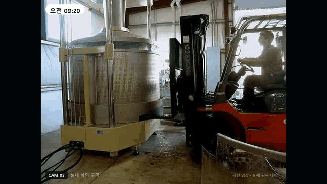

# HIMEC EYE — 직무별 비전 AI 관제

현장 사진을 **직무별 전용 모델**이 판독하고, 공통 룰엔진이 **근거 조항 · 위험도 · 조치사항**을
붙여 지적사항을 산출합니다.

[](https://youtu.be/KwVEdUqCQhc)

> 실제 판독 결과입니다. 지게차 작업반경과 작업자 박스의 겹침으로 협착 위험을 판정합니다 —
> 지게차와 작업자를 **각각** 검출하는 것만으로는 나오지 않는 판정입니다.

**[전체 영상 (36초 · 4개 현장)](https://youtu.be/KwVEdUqCQhc)**  ·
**[온라인 시연 열기](https://himec-eye-panel.vercel.app)**  ·
**[기술 문서](project/README.md)**

---

## 차별점

**하나의 만능 모델을 만들지 않았습니다.** 2차전지 셀의 극성 반전과 지게차 협착 위험은
찍는 대상도, 판정 기준도, 근거 법규도 다릅니다. 직무마다 전용 모델과 전용 규칙을 가진
에이전트를 두고, 오케스트레이터가 결과를 위험도 순으로 합칩니다.

**법규 판정에 LLM을 쓰지 않았습니다.** 조항을 잘못 인용한 검측 문서는 문서로서의 가치를
잃습니다. 판정은 코드로 고정된 규칙 21개가 담당하며, 각 규칙은 근거 조항 · 위험도 4단계 ·
조치사항을 함께 갖습니다.

**항목마다 임계값이 다릅니다.** 오탐과 미탐의 비용이 항목마다 다르기 때문입니다.

| 항목 | 임계값 | 방향 | 이유 |
|---|---:|---|---|
| 안전모 미착용 | 0.25 | 재현율 우선 | 놓치면 사고로 이어집니다 |
| 연기 · 화재 | 0.55 | 정밀도 우선 | 오경보를 남발하면 현장이 경보를 무시합니다 |
| 역극 셀 | 0.25 | 재현율 최우선 | 유출 시 클레임 · 안전사고 |
| 정렬 정상 셀 | 0.40 | 보수적 확정 | 확실할 때만 정상으로 확정합니다 |

역극 셀 0.25 / 정상 셀 0.40 — 같은 공정 안에서도 방향이 반대인 정책을 씁니다.

**관계 추론.** 단일 객체가 아니라 객체 사이의 관계에서 나오는 판정입니다.
지게차 박스를 좌우 35% · 상하 17.5% 확장한 영역에 작업자 박스가 35% 이상 겹치면 협착 위험.
보호구도 '작업자는 있는데 머리 구간에 안전모가 없다'는 관계로 미착용을 추론합니다.
미착용 학습 데이터가 착용 대비 6.3:1로 부족해, 모델 대신 규칙으로 보완한 구조입니다.

---


## 구성

```
project/src/     데이터 수집 · 학습 · 판독 엔진 · 룰엔진 · 문서/영상 생성기
project/docs/    제안서 전문 · 데이터셋 라이선스 명세
site/            시연 페이지 (화면 5종, 정적 파일 일체)
```

시연 페이지의 판정 로직(임계값 정책 · 관계 추론 · 위험도 산정 · 근거법규 매핑)은
파이썬 룰엔진 `project/src/rules.py` 와 **같은 조건으로 브라우저에서 실행**됩니다.

재현 방법은 [`project/README.md`](project/README.md) 를 참고하세요.

---

## 라이선스 유의

프로토타입은 Ultralytics YOLO11(AGPL-3.0)로 학습했습니다. 상용 적용 시에는 상용 라이선스를
취득하거나 Apache-2.0 계열 대체 모델로 재학습해야 합니다.
학습 데이터는 라이선스가 명확한 공개 데이터셋(CC / CC0)만 사용했으며,
출처와 라이선스는 [`project/docs/데이터셋_라이선스.md`](project/docs/데이터셋_라이선스.md) 에 정리했습니다.
